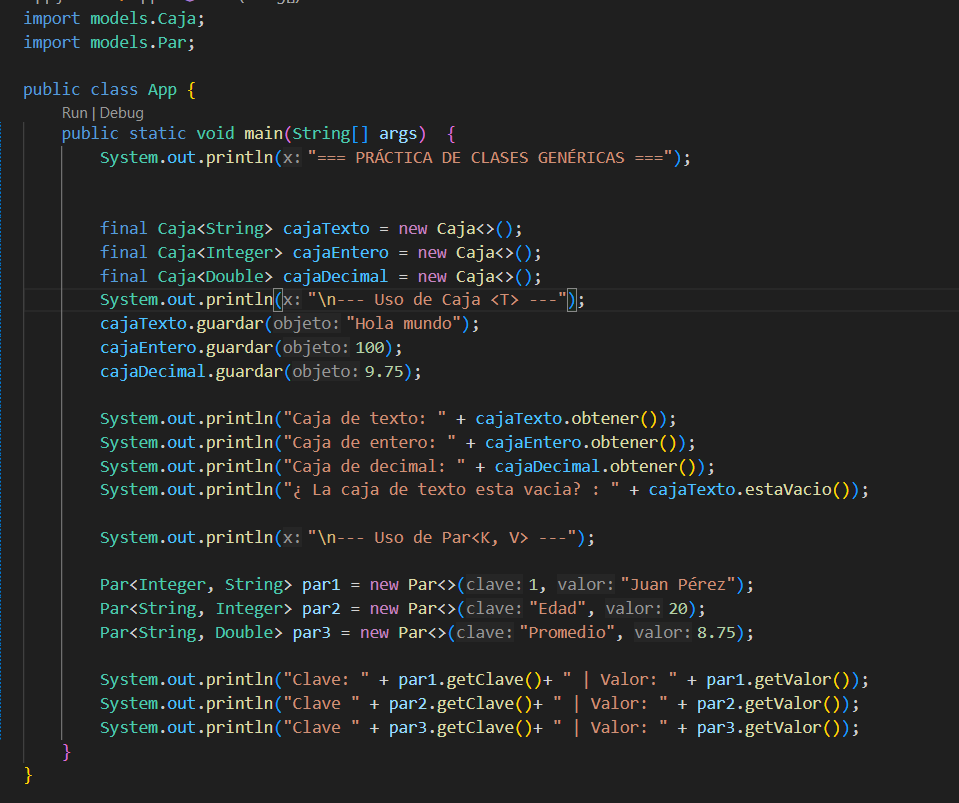

Se debe usar el formato de README par las practicas en el archivo README.md en la raíz del proyecto con el siguiente formato:

# Práctica: Clases Genéricas en Java

## Datos del Estudiante
- **Nombre:** [Michelle Marca]
- **Curso:** [2 ciclo Computacion]
- **Fecha:** [2 de Junio del 2026]

---

## 1. Implementación de Caja<T> y Par<K, V>

**Fecha:** [Fecha en la que se realizó la práctica]
**Descripción:** En esta práctica se implementaron las clases genéricas Caja<T> y Par<K, V> dentro del paquete models. La clase Caja<T> permite almacenar y obtener un dato de cualquier tipo, mientras que la clase Par<K, V> permite representar una relación entre una clave y un valor. En la captura se muestra la ejecución del programa en consola con diferentes tipos de datos.

